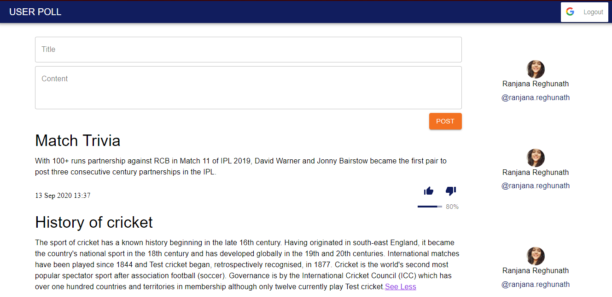

# User Poll (IPL)

A MERN stack based application that lets users create post and vote on them.

## Setup Instructions:

### Backend:

1. To install dependencies, run -

   ` npm install`

2. To run the server -

   ` node app.js`

3. To run MongoDB server -

   ` mongod`

- local mongoDB needs to be running

- To install mongoDB- https://meet.google.com/linkredirect?authuser=0&dest=https%3A%2F%2Fdocs.mongodb.com%2Fmanual%2Finstallation%2F

## Frontend:

1. To install dependencies, run-

   ` npm install`

2. To run the application -

   ` npm start`

3. On your browser go to localhost:3000 to view the application.

- login has been implemented using Google Authentication.

